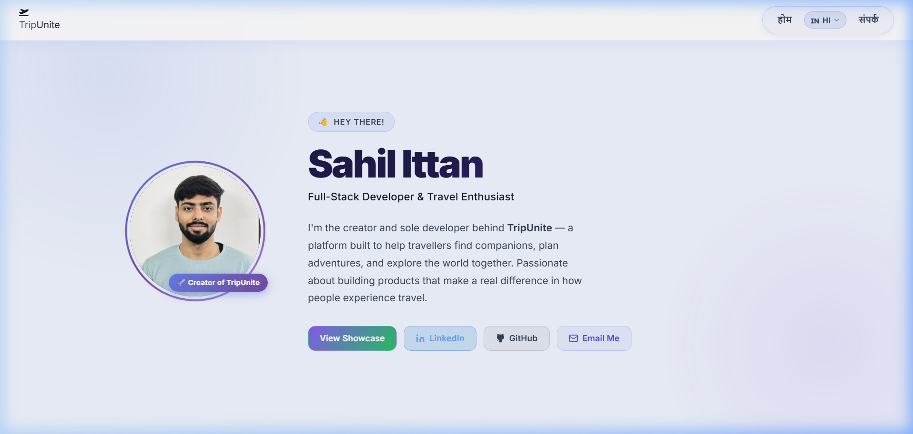
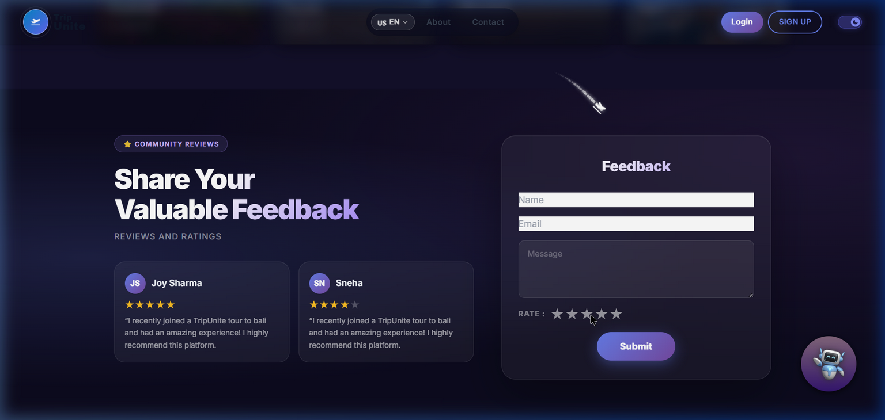
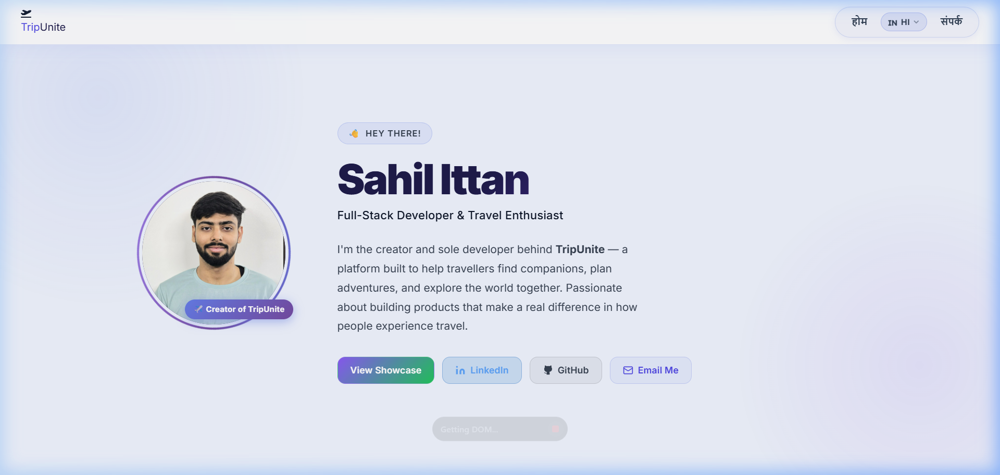
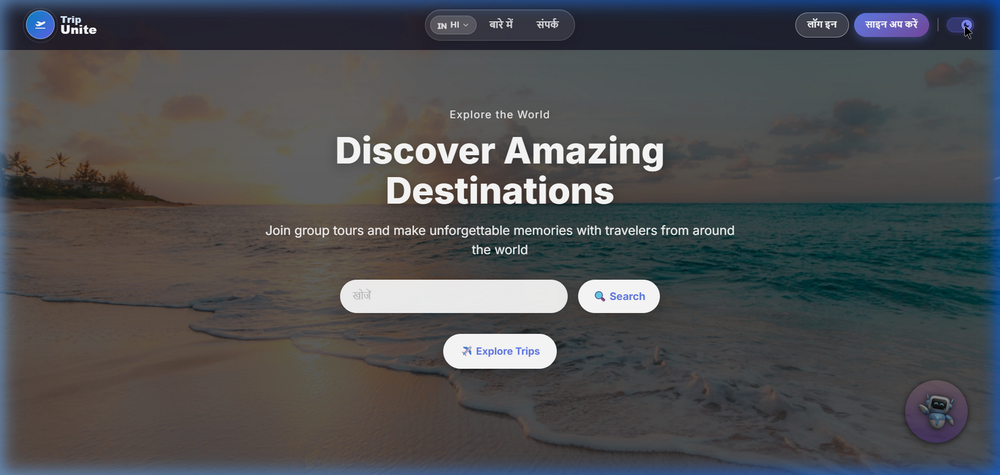

# 🌍 TripUnite

<p align="center">
  <strong>Find your tribe. Explore the world.</strong><br />
  A modern, full-stack travel companion platform for discovering trips, meeting people, and planning journeys together.
</p>

<p align="center">
  
  
  
  
  
</p>

---

## 📸 Screenshots

| 🔍 Explore Destinations | 💬 Feedback & Ratings |
| :---: | :---: |
|  |  |

| 👨‍💻 Creator Profile | 🛠️ Tech Stack |
| :---: | :---: |
|  |  |

| 📞 Contact Us | 📊 User Dashboard |
| :---: | :---: |
|  |  |

---

## 🚀 What is TripUnite?

Travel feels better when it is shared. **TripUnite** was built to solve the hardest part of group travel: finding the right people to go with.

It is a full-stack platform that allows users to:
- 🔍 **Find travel companions** based on destination and travel style
- 🏕️ **Create and join trips** through a guided, intuitive flow
- 🤖 **Plan journeys** with a built-in AI travel assistant
- 🌙 **Seamlessly switch** between premium Dark and Light modes
- 🌍 **Experience a localized UI** with built-in Language Selection

## ✨ Key Features

### User Experience (UI/UX)
- **Glassmorphism Aesthetic**: Modern, translucent UI elements with smooth micro-animations.
- **Global Theme System**: Robust light/dark mode toggle persisting across all pages.
- **Form Validation**: Inline, real-time client-side validation for all forms (Contact, Feedback, Login/Signup).
- **Interactive Feedback**: Dynamic star-rating system with hover states.

### Core Product Flow
- **Authentication**: Secure JWT-based login and registration.
- **Trip Dashboard**: A centralized hub to manage created trips and review join requests.
- **Interactive Chatbot**: AI-powered travel assistant integrated directly into the app.
- **Language Selector**: Premium animated dropdown for seamless i18n localization (English/Hindi).
- **Showcase Page**: A dedicated presentation page highlighting product strengths and mock testimonials.

---

## 🛠️ Tech Stack

### Frontend
- **React.js** (Hooks, Context API)
- **React Router** for seamless SPA navigation
- **react-i18next** for internationalization
- **Axios** for API communication
- **Tailwind CSS / Custom CSS Variables** for responsive design

### Backend & Database
- **Node.js & Express.js**
- **Supabase** (PostgreSQL) for scalable database management
- **JWT (JSON Web Tokens)** for secure authentication
- **Bcrypt** for password hashing
- **Google Generative AI SDK** for the chatbot

---

## 💻 Getting Started (Local Development)

### 1. Prerequisites
- Node.js (v18+)
- Supabase Project (for database credentials)
- Gemini API Key (for AI features)

### 2. Clone & Install
```bash
git clone https://github.com/Jamiwal-3704/TripUnite.git
cd TripUnite

# Install backend dependencies
cd back-end
npm install

# Install frontend dependencies
cd ../front-end
npm install
```

### 3. Environment Variables
Create `.env` files based on the provided `.env.example` templates.

**`back-end/.env`**:
```env
PORT=8000
jwt_secret=your_super_secret_jwt_key
GEMINI_API_KEY=your_gemini_api_key
CORS_ORIGIN=http://localhost:3000
SUPABASE_URL=https://your-project.supabase.co
SUPABASE_SERVICE_ROLE_KEY=your_service_role_key
```

**`front-end/.env`**:
```env
REACT_APP_API_BASE_URL=http://localhost:8000
REACT_APP_SUPABASE_URL=https://your-project.supabase.co
REACT_APP_SUPABASE_ANON_KEY=your_anon_key
```

### 4. Run the App
Start both servers simultaneously in two terminal windows:

```bash
# Terminal 1 (Backend)
cd back-end
npm run dev

# Terminal 2 (Frontend)
cd front-end
npm start
```
- **Frontend**: `http://localhost:3000`
- **Backend API**: `http://localhost:8000`

---

## ☁️ Deployment

TripUnite is ready to be deployed to modern serverless platforms.

### Frontend (Recommended: Vercel)
1. Import the repository to Vercel.
2. Set the **Root Directory** to `front-end`.
3. Add the Frontend Environment Variables in the Vercel dashboard.
4. Deploy!

### Backend (Recommended: Railway or Render)
1. Import the repository.
2. Set the **Root Directory** to `back-end`.
3. Add the Backend Environment Variables.
4. Ensure `CORS_ORIGIN` matches your deployed Vercel frontend URL.

---

## 🤝 Contributing
Contributions, issues, and feature requests are welcome! Feel free to check the [issues page](https://github.com/Jamiwal-3704/TripUnite/issues).

<p align="center">
  Designed & Built with ❤️ by <a href="https://github.com/Jamiwal-3704">Jamiwal-3704</a>
</p>
